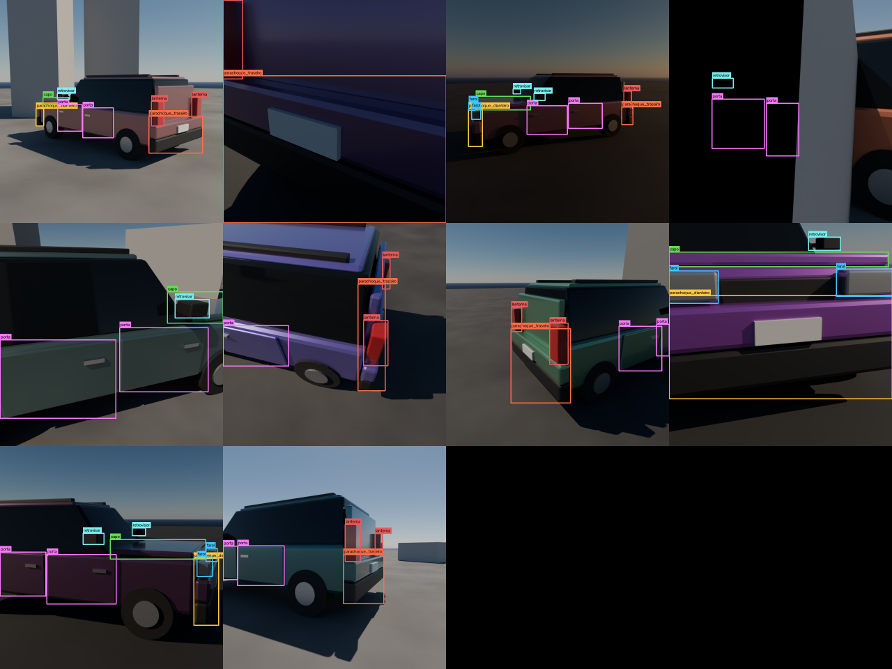
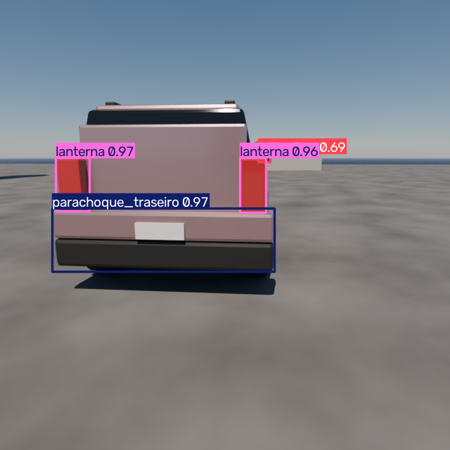
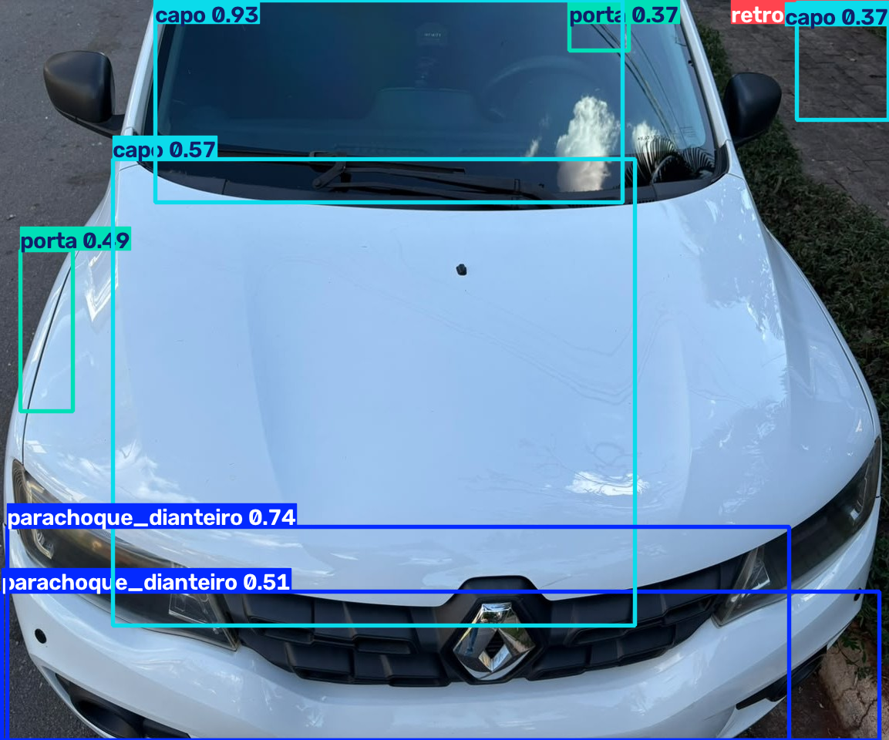

# SinistroScan — pré-triagem de sinistros com visão computacional e dados 100% sintéticos

> Desafio final FastCamp: geração de dataset sintético com Blender + treinamento de modelo de detecção de objetos.
>
> 🚧 **Em desenvolvimento** — acompanhe o status das etapas abaixo.

## O problema

Quando um cliente aciona o seguro após uma batida, o primeiro passo é uma triagem: alguém precisa olhar as fotos enviadas e identificar quais peças do veículo foram atingidas para estimar o orçamento. Esse processo manual é lento, repetitivo e cria gargalo nas seguradoras.

O **SinistroScan** é o primeiro estágio automatizado dessa triagem: um detector de peças automotivas treinado **exclusivamente com imagens sintéticas** renderizadas no Blender. A partir das fotos do cliente, o sistema:

1. Detecta as peças visíveis na imagem (para-choques, capô, faróis, portas, lanternas);
2. Infere a região provável do impacto (frontal, lateral ou traseira);
3. Gera uma pré-lista de peças para o analista humano validar.

O projeto foi desenvolvido para verificar as peças mais simples no externo do carro, envolvendo portas, capô, faróis, entre outros.

## Pipeline

```
Cena 3D (Blender) ──> Script bpy: renders randomizados + anotação automática (YOLO)
                                        │
                                        ▼
                            Dataset sintético (treino/validação/teste)
                                        │
                                        ▼
                        Treinamento YOLOv8 (PyTorch + CUDA)
                                        │
                                        ▼
                  Avaliação (mAP, matriz de confusão) + demo de triagem
```

## Estrutura do repositório

```
├── README.md
├── requirements.txt
├── blender/
│   └── cena.blend              # cena configurada (carro, câmera, luz)
├── scripts/
│   ├── construir_cena.py       # bpy: constrói o carro e a cena do zero
│   ├── gerar_dataset.py        # bpy: renderização + anotação automática
│   ├── organizar_dataset.py    # divide em train/valid/test + data.yaml
│   ├── visualizar_anotacoes.py # desenha as bboxes para conferência
│   └── triagem_demo.py         # demo: foto -> peças -> região do sinistro
├── dataset/                    # não versionado — baixe pelo Release
│   ├── data.yaml
│   ├── train/{images,labels}
│   ├── valid/{images,labels}
│   └── test/{images,labels}
├── treinamento/
│   └── treinar.py
├── modelos/
│   └── best.pt                 # pesos do modelo treinado
└── docs/
    ├── relatorio.md            # documentação técnica detalhada
    ├── triagem_exemplo.json    # exemplo de saída da triagem
    └── img/                    # figuras do relatório e do README
```

## Dataset

O dataset sintético (1.200 imagens, 6.247 anotações) **não é versionado no Git** por causa do tamanho — baixe o arquivo `sinistroscan_dataset.zip` na [aba Releases](../../releases) deste repositório e extraia onde preferir. O `data.yaml` já vem configurado com caminhos relativos, então basta apontar o treinamento para ele.

Como alternativa, o dataset inteiro pode ser **regenerado do zero** com os scripts (ver seção seguinte) — o pipeline é determinístico: a mesma semente produz exatamente as mesmas imagens.

## Tecnologias

- **Blender 4.x** (Cycles com GPU) + scripting em Python (`bpy`)
- **Python 3.12**, **Ultralytics YOLOv8**, **PyTorch (CUDA)**, OpenCV, NumPy

## Instalação

Pré-requisitos: **Blender 4.2+** (testado no 5.2 LTS) e **Python 3.12**.

```bash
python -m venv .venv
.venv\Scripts\activate
# GPU NVIDIA (recomendado):
pip install torch torchvision --index-url https://download.pytorch.org/whl/cu124
pip install -r requirements.txt
```

## Como gerar o dataset

```bash
# 1) (Re)construir a cena — cria blender/cena.blend e um render de teste
blender -b --factory-startup -P scripts/construir_cena.py -- --render-teste

# 2) Gerar as imagens + anotações YOLO (use uma pasta fora de diretórios sincronizados)
blender -b blender/cena.blend -P scripts/gerar_dataset.py -- --n 1200 --out D:/dataset --seed 42

# 3) Dividir em train/valid/test e escrever o data.yaml
python scripts/organizar_dataset.py --dataset D:/dataset

# (opcional) conferir as anotações visualmente
python scripts/visualizar_anotacoes.py --pool D:/dataset/train --n 12
```

A geração é retomável (re-executar pula o que já existe) e reprodutível (mesma seed ⇒ mesmas imagens). Na RTX 4070 SUPER: ~2 s/imagem.

## Como treinar o modelo

```bash
python treinamento/treinar.py --data D:/dataset/data.yaml --epocas 100 --batch 32
```

Baixa os pesos `yolov8n.pt` (COCO) automaticamente na primeira execução, treina com os dados 100% sintéticos e avalia no split de teste. Resultados em `runs/`.

## Demo de triagem

```bash
python scripts/triagem_demo.py --imagem caminho/para/foto.jpg --modelo modelos/best.pt
```

Saída: JSON com as peças detectadas, a **região provável do impacto** (frontal/lateral/traseira) e a pré-lista de peças para orçamento, além da imagem anotada.

## Resultados

Avaliação no split de **teste** (120 imagens sintéticas nunca vistas):

| mAP50 | mAP50-95 | Precisão | Recall | Inferência |
|-------|----------|----------|--------|------------|
| **0,988** | **0,916** | 0,982 | 0,957 | 2,8 ms/img (GPU) |



Exemplo da demo de triagem (foto → peças → região do impacto):



O modelo também foi testado em **fotos reais de um Renault Kwid** (transferência parcial: capô e para-choque/grade detectados corretamente nas regiões certas, sem nenhuma foto real no treino):



## Licenças e créditos

**Nenhum asset de terceiros é usado.** O veículo, os materiais, a textura do asfalto e a iluminação são 100% procedurais, gerados por `scripts/construir_cena.py` — sem modelos 3D, texturas ou HDRIs baixados. As imagens do dataset são obra original: a GPL do Blender cobre o programa, não o conteúdo produzido com ele.

| Software | Versão | Licença |
|----------|--------|---------|
| Blender | 5.2 LTS | GNU GPL (fonte: GPLv2+; binário distribuído: GPLv3+); Cycles sob Apache-2.0 |
| Ultralytics | 8.4.115 | **AGPL-3.0** |
| PyTorch / torchvision | 2.6.0+cu124 / 0.21.0+cu124 | BSD-3-Clause |
| NumPy | 2.4.4 | BSD-3-Clause |
| OpenCV (`opencv-python`) | 5.0.0.93 | Apache-2.0 |
| Pillow | 12.2.0 | MIT-CMU |
| Matplotlib | 3.11.1 | PSF-based (BSD-compatível) |
| PyYAML | 6.0.3 | MIT |

Os pesos iniciais `yolov8n.pt` (pré-treinados no COCO) são distribuídos pela Ultralytics sob AGPL-3.0. Segundo a [licença publicada pela Ultralytics](https://www.ultralytics.com/license), a AGPL-3.0 cobre tanto o código de treinamento quanto os modelos por ele produzidos — portanto **`modelos/best.pt` também está sob AGPL-3.0**, assim como este repositório. Vale reforçar que nenhuma imagem real participou do treinamento: do COCO vêm apenas os pesos iniciais (transfer learning).
